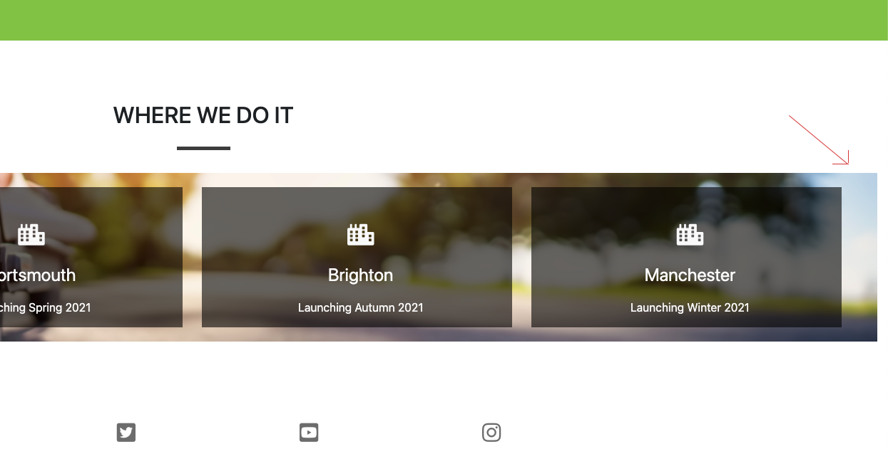
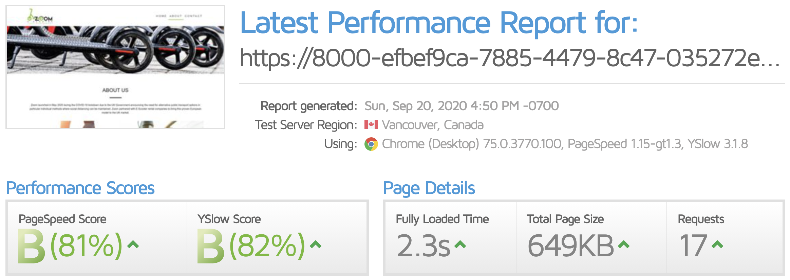
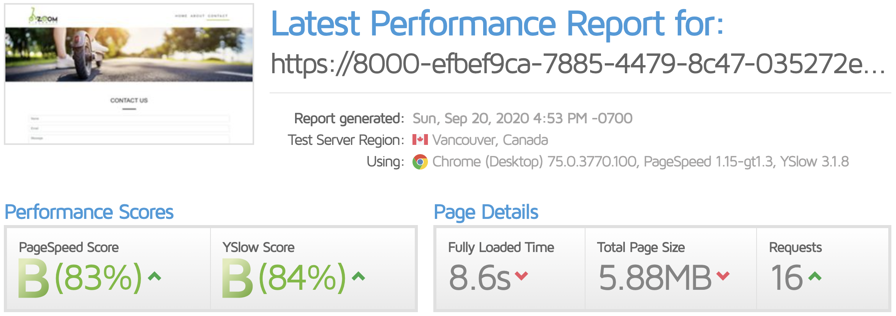
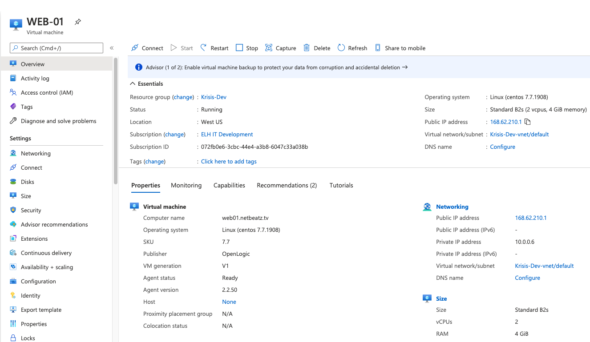

---

# Zoom Scooters

My project is to support a new business for E-Scooter Fleet management. The business will be deploying E-Scooters around the UK partly in response to COVID-19. UK goverment wanted a solution to public transport overcrowding and social distancing.

The project is designed to provide information to the public on what we do and why do it. Already there is a negative feeling about the addition of scooters due to the illegal use of personal E-Scooters, we intend to provide the facts and help show how E-Scooters are a good thing for the public. Including the home page I have focused on three pages:

- Home - Here I have given an introduction to what the company does, what we do and where we do it.
- About - This page goes into more detail with an interactive/collapsible FAQ style section to allow the user to read answers to the most common questions we recieve.
- Contact Us - Users have the oppertunity to fill out a contact form to send us a message or question and view our contact information.

---

## UX

The website is aimed at the public so I believe users will be a variety of age ranges. I have also used colours that match the green logo which was chosen to show E-Scooters are are clean alternative to fossil fuel transport options. The navigation bar also features the custom logo. On smaller screens, the navigation links compress behind a toggle button. The purpose of the website is to inform and entertain Ipswich Town fans.

Users:

- As a user, I'd like to learn more about what an E-Scooter Fleet Managment company is.
- As a user, I'd like to learn more about the E-Scooters and how they are charged.
- As a user, I'd like to learn more about how E-Scooters are maintained.
- As a user, I'd like to learn more about how E-Scooters are tracked and recovered
- As a user, I'd like to learn more about how E-Scooters are distributed across the cities.
- As a user, I want an easy way to get in touch to ask further questions or send a general message.

[Click here to see my full Wireframe](assets/wireframes/ZoomWireframes.pdf)

**Wirefram Deviation**: Comparison to the wireframes will show that I deviated from the sketches slightly with the content in each section. This is due to a delay in the launch of the business.
- Orginally I had planned to already be running the business by the time this project was completed, however due to delays outside my control the launch has not taken place.
- Cities were unconfirmed and statistics such as number of scooters in each area to hand and model of scooters deployed. This meant having a section dedicated to statistics did not make sense. 
- I considered doing the wireframs again after the site was completed however I felt this was disingenuous in nature and would not accurately show the true progression of the UX design process. I do feel however the overall UX design intentions were kept and achieved. 

**Navigation**: The navigation bar uses Bootstrap 4 features, responsiveness using a hamburger style button when on smaller devices and includes the custom logo designed for the company. The navigation bar has been used on all pages and is consistant across the site. To give the user an indication of which page they are currently on I have used a green bottom border on the active page.

**Footer**: I have used a simple footer design which has four social Font Awesome icons/links to Facebook, YouTube, Twitter and Instagram. To supplement these I have added the company 0800 phone number and parent company name. The footer is used consistantly across all pages.

**Home page**: I have used a hero/jumbotron with a background image of that changes across all three pages to keep interest. The images used are bought and licensed to the company from Adobe stock. The images used are all of E-Scooters in use in a fun, safe and natural manner. Below the hero image there is an introduction section with a breif information on the comapany, two further responsive images and a company tagline to reinforce the companies position. Below this I have added a functions section with the companies branded green colour taken from the logo. The function section has the four main task we complete with a bootstrap button to link to the about us page. Each of the functions uses a Font Awesome icon to reinforce each function. The entire function section uses the Bootstrap grid system for responsiveness and implements two rows and two columns. The cities section is next which displays cities where the company will deploy E-Scooters and the launch periods intended for each with a Font Awesome icon to complement. The standard footer finishes the page.

**About Us**: Keeping with consistancy the navbar, hero and introduction text section is reused here with alternative text and hero image. In the contrasting green section as seen on also on the home page I have included a collapsible unordered list in a FAQ style. Using Bootstrap 4 grid system, four rows with one function per row, each function has three questions which when clicked expand to show the answer. Each function section also sports the same Font Awesome icon used on the home page. The functions section is well responsive and works well on all devices. The page is finished with the standard footer.

**Contact**: Again navbar and hero are resused with alternative hero image. Following this is the contact form created using Bootstrap 4 features, this form is validated using the Code Institute validation tool. It features four form controls, name, email, message and a button. The button is plain as I did not want to overuse the green too much. Below the form is a section showing contact information with differnt styling to ensure good contract with the green background. The information in this section features clickable links to phone and email. Following this is the cities section as seen on the home page with the standard footer finishing the page.

---

## Features

### Existing features

- On the Home page we feature a hero which is responsive. The image used is different on all three pages.
- Navigation bar is responsive using a hamburger toggle button when used on small pages.
- The About Us page contains a collapsible FAQ section which is entirely CSS based with some simple animation to make it appear to open and close smoothly.
- Both the home page and contact page have a cities section which changes display to ensure responsiveness as do all other images using Bootstrap 4 img-fluid class.
- The Contact page has a Bootstrap 4 form which is also responsive and validates the text entered in the email field and validation on the information using the Code Institute page [Code Institute Form Validation](https://formdump.codeinstitute.net/)
- Google Analytics code has been added to allow extensive tracking of website vistor information.
- An 0800 number is used across all pages in the footer, this was purchased and linked to a SIP softphone on my mobile phone.

---

## Technologies & Services Used

I used the following languages, frameworks, libraries and external services to build this website:

- [HTML5](https://en.wikipedia.org/wiki/HTML5) - HTML5 was used to code the content of the website.
- [CSS3](https://en.wikipedia.org/wiki/Cascading_Style_Sheets) - CSS3 was used to style the content.
- [Bootstrap](https://getbootstrap.com/) - Bootstrap was used to provide a grid structure, navigation toggle effect, navigation links on the Highlights page and multiple other styles by utilising Bootstrap classes such as margins, padding, allignment of text/objects, text decoration, etc.
- [Code Institute Form Validation](https://formdump.codeinstitute.net/) - This form dump was used to validate the form information.
- [FontAwesome](https://fontawesome.com/) - FontAwesome was used to insert icons into the webpage. These appear in the Home page as function icons, in the footer as the social media links.
- [Logo, FavIcon & Apple Icons](https://www.designcrowd.com/) - This site was used to source a graphics designer for the logo, favicon and Apple icons.
- [Collapsible list](https://www.digitalocean.com/community/tutorials/css-collapsible) - The code example here was used to create the collapsible FAQ section on the About page and then was customised to suit the needs of the site.
- [Google Analytics](https://analytics.google.com/) - The code used was supplied from the Google Analytics dashboard and is specific to this site.
- [0800 Phone Number](http://www.ttnc.co.uk/) - An 0800 number was purchased from TTNC.

---

## Testing

### Bugs

The only bug I have found is the margin on the right hand side of the cities section. This was tricky and I was unable to find a fix for this. If I was to develop this project further in the futire I would put a lot of time into fixing this. I adjusted margins and paddings and when fixing it on one size screen it would make it worse on others.

### Speed Tests

I ran speed tests on each page using [GTmetrix](https://gtmetrix.com/).

Below are screenshots of the tests:

My aim was for all pages to be around 80% on page speed and YSlow scores which all pages were apart from the home page at 79% which I deemed OK.

### Further Tests

1. Home page:

   1. All links tested. Internal links all work. There are no external links to test but email and telephone links were tested and work on all devices. Telephone correctly will prompt to call on a phone and email opens the default mail client on the device.
   2. The page is responsive and looks good on all screen sizes.
   3. The user is able to quickly see that the website is about E-Scooters by way of the hero background image and the logo.
   4. The introduction section underneath the hero gives information in a clear way to detail the site and reinforce message. This is also supported by relevant images of E-Scooters in use.
   5. The function read more links underneath each of the function navigate to the about us page where more information is provided.
   6. The nav bar was test on all screen sizes to ensure it shirnks as expected.
   7. The social icons display and link correctly.
   8. The cities section display and shrink while maintaining responsiveness.
   9. Code has been successfully tested through the [Markup Validator](https://validator.w3.org/) no errors found only warnings which I do not believe to a problem.

2. About Us page:

   1. All links tested. Internal links all work. There are no external links to test but email and telephone links were tested and work on all devices. Telephone correctly will prompt to call on a phone and email opens the default mail client on the device.
   2. The page is responsive and looks good on all screen sizes.
   3. The collapsible FAQ functions section works well on all screen sizes.
   4. The nav bar was test on all screen sizes to ensure it shirnks as expected.
   5. The social icons display and link correctly.
   6. Code has been successfully tested through the [Markup Validator](https://validator.w3.org/) no errors found only warnings which I do not believe to a problem.

3. Contact page:

   1. All links tested. Internal links all work. There are no external links to test but email and telephone links were tested and work on all devices. Telephone correctly will prompt to call on a phone and email opens the default mail client on the device.
   2. The page is responsive and looks good on all screen sizes.
   3. The contact form was tested with form dump and works well on all screen sizes.
   4. The nav bar was test on all screen sizes to ensure it shirnks as expected.
   5. The social icons display and link correctly.
   6. The cities section display and shrink while maintaining responsiveness.
   7. Code has been successfully tested through the [Markup Validator](https://validator.w3.org/) no errors found only warnings which I do not believe to a problem.

5. style.css
   1. 6. Code has been successfully tested through the [CSS Jigsaw Validator](https://jigsaw.w3.org/css-validator/)

---

## Deployment

This webpage has been deployed to [GitHub pages](https://niallhatton.github.io/Scooters/) for the purposes of the project/learning.

The domain [Zoom Scooters](http://www.zoomscooter.co.uk/) was purchased for this project using gandi.net, DNS records are also configured here. A sub domain [Zoom Scooters](http://dev.zoomscooter.co.uk/) was used as a staging site with the main domain hosting a holding page while development was taken place.

The site is hosted in Azure cloud on a custom VM I manage. DNS records in [Gandi](http://gandi.net/Gandi) are pointing to the Azure VM public IP address 168.62.210.1.

The Azure VM is running Centos 7 with Webmin/Virtualmin for hosting software custom installed. Webmin allows for a GUI to easily create multiple hosting for each site.

**Azure VM Specification** 
The VM is a Standard B2s (2 vcpus, 4 GiB memory) running Linux (centos 7.7.1908) the location of this VM is in the West US datacenter. This is because I have other services in that location and it was easier to deploy alongside existing VM's into the same resource group.

**Azure VM Control Panel Software**
[Virtualmin](https://virtualmin.com/) - Open Source Web Hosting and Cloud Control Panels. Virtual hosts/servers have been created for the main domain and the development subdomain.

---

## Credits

### Content

Where code has been copied from an external source it has been documented here. I also used code from my other projects, these include Love Running, Whiskey Drop and Resume.

**Head**

- All CDN links copied from the respective sources - see links above in the **"Technologies Used"** section.
- The FavIcon code snippet was taken from [Digital Ocean](https://www.digitalocean.com). I viewed the source of the home page and copied the code to my site. The Favicon image was created along with my logo from a designer sourced from [Design Crowd](www.designcrowd.com)
- The Apple icons for use on iPhone and iPad code snippet was taken from [Digital Ocean](https://www.digitalocean.com). I viewed the source of the home page and copied the code to my site. The Apple icon image was created along with my logo from a designer sourced from [Design Crowd](www.designcrowd.com)
- The Google Analytics code was provided by the Google dashboard [Google Analytics](https://analytics.google.com/). 

**Header**

- In the header, the nav element code used to create a toggle menu on small screen sizes was copied from [Start Bootstrap](https://startbootstrap.com/snippets/navbar-logo/). The code to change the colour was taken from [Code Ply](https://www.codeply.com/go/4FdZGlPMNV)

**About Us**

- On the About Us page I added collapsible unordered lists for the FAQ section the basis of this code was taken from [Collapsible list](https://www.digitalocean.com/community/tutorials/css-collapsible)

**Readme Template**

- I used a readme as a template from another students project which was provided to me by my mentor. I then edited it for my project. [Luke Garnham Readme Template](https://github.com/LukeGarnham/One-Day-In-May-MS1) 

### Media

**Images**

- The images used in the project have been found on Adobe Stock images. The images are high resolution and I edited them to suit what I required. I own a license for all the images used
- Links to the images on Adobe Stock below.
  1. [Hero Image 1](https://stock.adobe.com/uk/images/city-electric-scooters-to-rent-parked/267823007?prev_url=detail)
  2. [Hero & Cities Image](https://stock.adobe.com/uk/images/woman-riding-on-scooter-in-park-in-summer/373479260?prev_url=detail)
  3. [Hero Image 3](https://stock.adobe.com/uk/images/modern-ity-transport-four-electric-scooters-is-parked-on-the-street-of-the-city/272027771?prev_url=detail)
  4. [Intro Image 1](https://stock.adobe.com/uk/images/close-up-of-electric-scooter-on-city-street-outdoor-ecology-concept/334265033?prev_url=detail)
  5. [Intro Image 2](https://stock.adobe.com/uk/images/crop-man-riding-electric-scooter/281114978?prev_url=detail)
 
 - As the logo, favicon and apple icons are a private project I am unable to link to the images.
 

