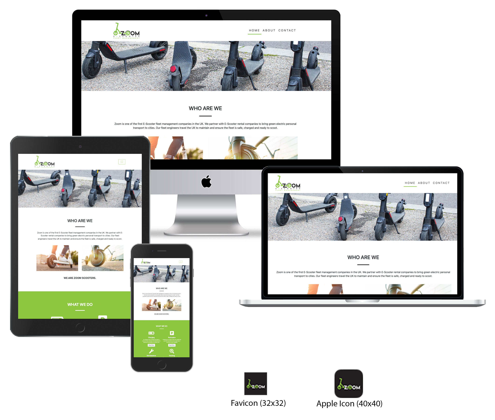

---

# Zoom Scooters

My project is to support a new business for E-Scooter Fleet management. The business will be deploying E-Scooters around the UK partly in response to COVID-19. UK goverment wanted a solution to public transport overcrowding and social distancing.

The project is designed to provide information to the public on what we do and why do it. Already there is a negative feeling about the addition of scooters due to the illegal use of personal E-Scooters, we intend to provide the facts and help show how E-Scooters are a good thing for the public. Including the home page I have focused on three pages:

- Home - Here I have given an introduction to what the company does, what we do and where we do it.
- About - This page goes into more detail with an interactive/collapsible FAQ style section to allow the user to read answers to the most common questions we recieve.
- Contact Us - Users have the oppertunity to fill out a contact form to send us a message or question and view our contact information.

---

## UX

The website is aimed at the public so I believe users will be a variety of age ranges. I have also used colours that match the green logo which was chosen to show E-Scooters are are clean alternative to fossil fuel transport options. The navigation bar also features the custom logo. On smaller screens, the navigation links compress behind a toggle button. The purpose of the website is to inform and entertain Ipswich Town fans.

Users:

- As a user, I'd like to learn more about what an E-Scooter Fleet Managment company is.
- As a user, I'd like to learn more about the E-Scooters and how they are charged.
- As a user, I'd like to learn more about how E-Scooters are maintained.
- As a user, I'd like to learn more about how E-Scooters are tracked and recovered
- As a user, I'd like to learn more about how E-Scooters are distributed across the cities.
- As a user, I want an easy way to get in touch to ask further questions or send a general message.

[Click here to see my full Wireframe](assets/wireframes/ZoomWireframes.pdf)

**Wirefram Deviation**: Comparison to the wireframes will show that I deviated from the sketches slightly with the content in each section. This is due to a delay in the launch of the business.
- Orginally I had planned to already be running the business by the time this project was completed, however due to delays outside my control the launch has not taken place.
- Cities were unconfirmed and statistics such as number of scooters in each area to hand and model of scooters deployed. This meant having a section dedicated to statistics did not make sense. 
- I considered doing the wireframs again after the site was completed however I felt this was disingenuous in nature and would not accurately show the true progression of the UX design process. I do feel however the overall UX design intentions were kept and achieved. 

**Navigation**: The navigation bar uses Bootstrap 4 features, responsiveness using a hamburger style button when on smaller devices and includes the custom logo designed for the company. The navigation bar has been used on all pages and is consistant across the site. To give the user an indication of which page they are currently on I have used a green bottom border on the active page.

**Footer**: I have used a simple footer design which has four social Font Awesome icons/links to Facebook, YouTube, Twitter and Instagram. To supplement these I have added the company 0800 phone number and parent company name. The footer is used consistantly across all pages.

**Home page**: I have used a hero/jumbotron with a background image of that changes across all three pages to keep interest. The images used are bought and licensed to the company from Adobe stock. The images used are all of E-Scooters in use in a fun, safe and natural manner. Below the hero image there is an introduction section with a breif information on the comapany, two further responsive images and a company tagline to reinforce the companies position. Below this I have added a functions section with the companies branded green colour taken from the logo. The function section has the four main task we complete with a bootstrap button to link to the about us page. Each of the functions uses a Font Awesome icon to reinforce each function. The entire function section uses the Bootstrap grid system for responsiveness and implements two rows and two columns. The cities section is next which displays cities where the company will deploy E-Scooters and the launch periods intended for each with a Font Awesome icon to complement. The standard footer finishes the page.

**About Us**: Keeping with consistancy the navbar, hero and introduction text section is reused here with alternative text and hero image. In the contrasting green section as seen on also on the home page I have included a collapsible unordered list in a FAQ style. Using Bootstrap 4 grid system, four rows with one function per row, each function has three questions which when clicked expand to show the answer. Each function section also sports the same Font Awesome icon used on the home page. The functions section is well responsive and works well on all devices. The page is finished with the standard footer.

**Contact**: Again navbar and hero are resused with alternative hero image. Following this is the contact form created using Bootstrap 4 features, this form is validated using the Code Institute validation tool. It features four form controls, name, email, message and a button. The button is plain as I did not want to overuse the green too much. Below the form is a section showing contact information with differnt styling to ensure good contract with the green background. The information in this section features clickable links to phone and email. Following this is the cities section as seen on the home page with the standard footer finishing the page.

---

## Features

### Existing features

- On the Home page we feature a hero which is responsive. The image used is different on all three pages.
- Navigation bar is responsive using a hamburger toggle button when used on small pages.
- The About Us page contains a collapsible FAQ section which is entirely CSS based with some simple animation to make it appear to open and close smoothly.
- Both the home page and contact page have a cities section which changes display to ensure responsiveness as do all other images using Bootstrap 4 img-fluid class.
- The Contact page has a Bootstrap 4 form which is also responsive and validates the text entered in the email field and validation on the information using the Code Institute page [Code Institute Form Validation](https://formdump.codeinstitute.net/)

---

## Technologies Used

I used the following languages, frameworks and libraries to build this website:

- [HTML5](https://en.wikipedia.org/wiki/HTML5) - HTML5 was used to code the content of the website.
- [CSS3](https://en.wikipedia.org/wiki/Cascading_Style_Sheets) - CSS3 was used to style the content.
- [Bootstrap](https://getbootstrap.com/) - Bootstrap was used to provide a grid structure, navigation toggle effect, navigation links on the Highlights page and multiple other styles by utilising Bootstrap classes such as margins, padding, allignment of text/objects, text decoration, etc.
- [Code Institute Form Validation](https://formdump.codeinstitute.net/) - This form dump was used to validate the form information.
- [FontAwesome](https://fontawesome.com/) - FontAwesome was used to insert icons into the webpage. These appear in the Home page as function icons, in the footer as the social media links.
- [Logo, FavIcon & Apple Icons](https://www.designcrowd.com/) - This site was used to source a graphics designer for the logo, favicon and Apple icons.
- [Collapsible list](https://www.w3schools.com/jquerymobile/tryit.asp?filename=tryjqmob_lists_collapsible) - The code example here was used to create the collapsible FAQ section on the About page.

---

## Testing

### Bugs

I have not found any bugs on the project.

### Speed Tests

I ran speed tests on each page using [GTmetrix](https://gtmetrix.com/). Following this, I reduced all of the images on my website using [tinyPNG](https://tinypng.com/). I also replaced the [Lightbox jquery file](assets/javascript/lightbox-plus-jquery.min.js) with a compressed version. I then ran the speed tests again to check whether the performance of the website has improved.

Below are the before and after screenshots of the tests. The page sizes have reduced and the perfomance score for each page has improved:

### Further Tests

1. Home page:

   1. All links tested. Internal links all work. External links all work and open in new window.
   2. The page is responsive and looks good on all screen sizes.
   3. The user is able to quickly see that the website is related to Ipswich Town by way of the jumbotron background image and on larger screens, the ITFC logo in the header.
   4. The introduction section underneath the jumbotron give context about the website meaning users are quickly able to identify if the website is of interest to them.
   5. The shortcuts links underneath the introduction ensure users can identify what content is available and how to access it.
   6. Code has been successfully tested through the [Markup Validator](https://validator.w3.org/)

2. Highlights page:

   1. All links tested. Internal links all work. External links all work and open in new window.
   2. Several internal links have been added to enable users to navigate content on the page more easily. Some reports are quite long so these links were added to avoid users having to scroll up and down the page and thus improve user experience.
   3. During testing of the page, I noticed that the background text would align left once the Bootstrap small screen size was reached whilst the text in the highlights section below would only align left once Bootstraps large screen was reached. To ensure consitent flow of the page, I ensured that all text alignments on the page changed at the same screen size; up to small breakpoint (576px) the text is center-aligned and above this, aligns left. This is the same breakpoint at which images are centered on their own or floated next to the text. This consistency will improve user experience.
   4. Having made the above fix, I am confident the page is responsive and looks good on all screen sizes.
   5. The background section and match reports enable users to learn more about the play-off matches.
   6. The YouTube videos and images enable users to experience the play-off matches.
   7. Code has been successfully tested through the [Markup Validator](https://validator.w3.org/)

3. Meet the Players page:

   1. All links tested. Internal links all work. External links all work and open in new window.
   2. The page is responsive and looks good on all screen sizes.
   3. All modals open as expected and close as expected when clicking either the cross button, close button or clicking outside of the modal.
   4. All images in the modal open the Lightbox at the correct part of the slideshow.
   5. The contents of the modals enable users to learn more about some of the players and they can read further by opening their Wikipedia page (in a new window) using the link provided.
   6. Code has been successfully tested through the [Markup Validator](https://validator.w3.org/)

4. Share page:

   1. All links tested. Internal links all work. External links all work and open in new window.
   2. The page is responsive and looks good on all screen sizes.
   3. The form contains two required fields, name and email address. If either of these are blank when the user tries to submit the form, default error messages appear.
   4. If the user doesn't enter a valid email address, the default error message notifies them.
   5. The Reset button behaves as expected.
   6. The Send button posts the form data to Code Institutes form dump page as expected.
   7. Code has been successfully tested through the [Markup Validator](https://validator.w3.org/)

5. style.css
   1. 6. Code has been successfully tested through the [CSS Jigsaw Validator](https://jigsaw.w3.org/css-validator/)

---

## Deployment

This webpage has been deployed to [GitHub pages](https://lukegarnham.github.io/One-Day-In-May-MS1/).

---

## Credits

### Content

Where code has been copied from an external source, I have referenced this in the code through comments. In many cases, the copied snippet has been amended from the source in order to achieve the desired result for this project. I have listed the various sources below as well.

**Head**

- All CDN links copied from the respective sources - see links above in the **"Technologies Used"** section.
- The FavIcon code snippet was taken from [Digital Ocean](https://www.digitalocean.com). I viewed the source of the home page and copied the code to my site. The Favicon image was created along with my logo from a designer sourced from [Design Crowd](www.designcrowd.com)
- The Apple icons for use on iPhone and iPad code snippet was taken from [Digital Ocean](https://www.digitalocean.com). I viewed the source of the home page and copied the code to my site. The Apple icon image was created along with my logo from a designer sourced from [Design Crowd](www.designcrowd.com)

**Header**

- In the header, the nav element code used to create a toggle menu on small screen sizes was copied from [Bootstrap](https://getbootstrap.com/docs/4.5/components/navbar/#nav).

**Highlights page**

- On the Highlights page, I created tabs to separate the highlights of the 3 matches. I copied code from [Bootstrap](https://getbootstrap.com/docs/4.5/components/navs/#javascript-behavior) to achieve this.

**Meet the Players**

- A portion of HTML code and CSS code was copied from [this website](https://www.w3schools.com/howto/howto_css_flip_card.asp) in order to create the flip-card effect on the player images. Some of the style rules were amended to suit the desired needs of this webpage.
- The code for the player modals was copied from [Bootstrap](https://getbootstrap.com/docs/4.0/components/modal/#vertically-centered). The actual contents of the modals is original work and has not been copied.
- The [Lightbox CSS library](assets/css/lightbox.css) and [Lightbox jquery file](assets/javascript/lightbox-plus-jquery.min.js) were downloaded in their entirety from [this website](https://www.lokeshdhakar.com/projects/lightbox2/#getting-started).

### Media

**YouTube**

- The YouTube videos of the 3 play-off matches are all ones recently posted by the official ITFC YouTube channel recently to mark the 20 year anniversary.
  1. [Game 1](https://www.youtube.com/watch?v=uzy3y_B1LJ0)
  2. [Game 2](https://www.youtube.com/watch?v=vYSh2FyACbM)
  3. [Game 3](https://www.youtube.com/watch?v=K0NsebNs1Cw)

**Images**

- The images used in the project have been found using Google searches. Unfortunately, there is no freely available repository for the images required. I found a series of high quality images on [Getty Images](https://www.gettyimages.co.uk/) all of which have a watermark on unless they are purchased. This meant some of the images used in the website are not high resolution/high quality though I did try to use the best images freely available.
- Some images were found in recent news articles which were published to mark the 20 year anniversary of the teams promotion.
  1. [Article 1](https://www.twtd.co.uk/ipswich-town-news/38311)
  2. [Article 2](https://www.eadt.co.uk/sport/ipswich-town-v-bolton-play-off-semi-final-1-6652862)
  3. [Article 3](https://www.eadt.co.uk/sport/ipswich-town-win-at-wembley-may-2000-1-6675069)
